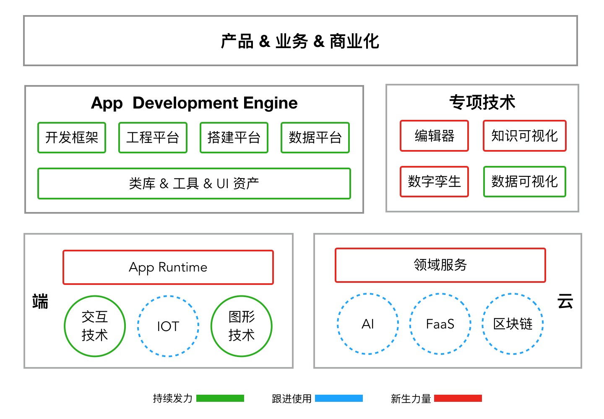

## 前端之未来

> 美国咨询公司高德纳公司（以下统称Gartner）2018年的一份报告中提到三项前端相关的战略技术：Digital Twin(数字孪生)、Immersive technologies、Smart Spaces，但当下的前端技术远不足以胜任这些领域。站在 201X 的末尾、互联网下半场的开始，不妨一起看看前端的未来在哪里，有哪些值得投入的方向。

### 前言

Digital Twin(数字孪生)，表示在计算机世界给现实世界的物理（飞船/城市）、系统（电力/交通）建立数字化镜像，让数字世界和物理世界更好地交互，数字大屏也可以算这种技术的一种应用场景。随着IOT、AI、图形技术、工业4.0的飞速发展，应用前景越来越广阔。在NASA、GE、Microsoft、SAP、IBM等巨头早已布局和应用这项技术。

前端为应用而生，人机交互技术是我们的生存之本，以应用为桥连接用户和数字世界是我们的使命。但长期以来前端的生存空间被压缩在Web领域，Digital Twin 这种新形态无疑将为我们打开一片新天地。Gartner 这份报告中还有两项技术和前端紧密相关：

* Immersive technologies: Augmented Reality(AR)、Virtual Reality(VR)、Mixed Reality(MR混合现实)等；

* Smart Spaces: 智慧城市、智能汽车、智能商店等；

看到未来有三项战略性技术居然和前端有关，既然是战略，也就意味着三五年内未必能全面铺开，再仔细分析会发现，当下的前端技术远不足以胜任这些领域，如果要成功抵达就需要未雨绸缪，站在201X的末尾、互联网下半场的开始，不妨先结合Gartner的报告分析，下一个10年前端技术的变革在哪里、有哪些值得大力投入的方向？

### 回顾过去

回顾Web技术的发展历史，可以清晰地看到三类促使变革发生的关键因子：

* 一、引擎：有四大引擎显得尤为重要：

  * V8: 不仅提升了JS的执行效率，助力ES规范落地，并且催生了Node.js；
  * 浏览器引擎：以Webkit、Blink、Chromium为典型代表，浏览器的高速发展为Web的繁荣奠定了基础；
  * Node.js：大大拓展了前端的生存空间，以至于“JS无所不能“.
  * Hybrid 容器：让被 App 统治的移动互联网时代也给 Web 开发留下了一席之地，小程序是典型代表

* 二、开发套件：语法、框架、工具、类库在社区的推动下一直在蓬勃发展，优秀的开源项目灿若星河，前端生态也成为技术圈中最活跃的。虽然以 React 为核心的主流技术栈上手成本还比较高，也做不到让开发人员只关心业务逻辑，但不可否认应用开发正在变简单。有些类型的应用甚至做到了无需 Coding 通过专门的可视化搭建平台就可以完成，比如：门户网站、营销活动、问卷调查等。

* 三、分工模式：前后端分离、BFF(Backend For Frontend)、全栈、全端、大前端等分工模式的创新不仅提高了前端和其它工种的协作效率，也让前端有机会承担应用研发。由“前端 + 设计”组合形成的“体验技术部”也成为很多业务的标配，部分前端团队甚至发展为应用研发团队并且拥有了自研产品。前端的影响圈已经从应用开发延展到了用户体验甚至产品设计，以人机交互为本的 体验科技 也开始崭露头角。

这些变革因子的背后是两条主线：

* 让现有研发工作做得更好：开发套件是主要推手，一些分工模式（比如：前后端分离）的创新也归属这条线；
* 开辟新战场：引擎是主要推手，一些分工模式（比如：全栈）的创新也归属这条线上。

这些变革之所以会发生，是因为有一个刚需：客户端软件的生产力水平满足不了飞速增长的互联网应用诉求，而前端技术恰好能提升应用研发的生产力水平。虽然移动互联网的崛起曾一度让前端缺少发力之处，但寄生于超级 App 上的 Hybrid 容器又让前端焕发了生机，小程序更是将之推向了和 PC 时代同样重要的地位。应用虽然琳琅满目，但其形态演化也是有迹可循的，简单介绍三个认为最重要的因子：

* UGC内容的主流载体在变：文本->图片->短视频/直播，用户创作内容的成本越来越低了；
* 终端的主流交互方式在变：PC(键盘/鼠标) ->手机/PAD（触屏/摄像头/语音），交互越来越自然、简单了；
* 信息获取的主流方式在变：主动获取->被动推送->智能推荐，异步->实时，信息已触手可得；

> 一个刚需、两条主线、三类因子也是我们预判未来的重要一句。

### 立足当下

在当下可实践的新技术中，前端相关的有：AI、Serverless/Faas、Blockchain、IOT、AR/VR/MR、智能硬件、可视化应用开发。它们都是能在一些领域带来颠覆性革命的技术，但是否会给前端带来变革呢？让我们详细分析一下：

* AI：核心是云，而且 AI 应用的典型特点是“重引擎轻 UI”，所以前端不在主赛道，只能在应用开发中使用它。目前市面上的 AI 应用，多数是大数据技术的延伸，离 Intelligence 还太远。作为人类技术的巅峰之作，AI 应该在人类最难解决的问题上发挥价值，比如：语言文字、医疗、科研、教育、环境等。个人看好机器翻译，打破语言界限将会是人类文明一次划时代的变革。作为前端，我们也应该去关注这些基础领域，并学习和掌握 AI 技术；

* Serverless/FaaS： 核心是云，前端能做的是基于这种技术优化 Node.js 在服务端的 Runtime 和运维方式，把服务端复杂的技术细节屏蔽掉，让 Node.js 开辟出来的服务端战场可以延续，让端上所需的数据能以简洁、低成本的方式存储和获取。当然，也可以基于它优化现有的工具体系，让开发越来越简单；

* Blockchain：核心还是云，和前端最相关的是 Decentralized Application(DApp)、IPFS(the InterPlanetary File System)。但 DApp 是一种新的应用形态，IPFS 改变的是网络协议。这两者还处于非常早起的阶段，发展形势还不明朗，最好是静观其变，在合适的时候基于它们开发应用；

* IOT：核心是端，但关键技术是硬件及嵌入式系统，和前端交集较少，发挥空间很有限。除了在之上开发应用外，能看到的还有两个潜在方向：把 Node.js、浏览器内核移植到 IOT 设备，打造一个可运行前端代码的 Runtime；部分设备需要展示数据，可以基于图形技术打造专属渲染引擎；

* AR/VR/MR：核心是硬件及交互方式的变化，前端能参与到类库及应用开发中。但受设备所限，目前还不是应用的主流，需要结合业务特点寻找切入点。

* 智能硬件：机器人则是这项技术的终极形态。其核心在 AI 、自动化控制及硬件上，给前端带来的更多是应用形态和交互方式的升级。

* 可视化应用开发：不写/少写代码就完成开发，这是前端的一个夙愿，不可能完全达成，但在特定场景下是可以做到的。MFC、Dreamweaver、Flash、Microsoft 是该领域的先驱，Wix、Webflow、Bubble、Node-RED、FrameX、PowerApps 是当下值得关注的。其本质上仍是通过更好的开发套件提升应用生产效率，其最大竞品是成品 SaaS 服务，毕竟拿来就用比搭建更简单，这就如同当需要一台电脑时多数人会选择买成品而不是买配件组装。

综上来看，这些新技术的关键路径和核心技术多数都不在前端，但我们能以使用者的身份参与进去，结合业务特点进行实践，让现有研发工作做得更好，不过，还是有两个前端强相关的技术有望带来变革：

* IOT上的App Runtime:其背后就是一个引擎，能让前端应用运行在越来越多的新型终端上；

* 可视化应用开发：有望把部分功能和应用的开发成本降到最小。

### 展望未来

应用形态日新月异，新技术风起云涌，未来扑朔迷离...作为前端，我们究竟该往那些方向进行技术储备呢？要找到有指导意义的技术路线图，除了前文这些分析外，还得回到前端的本质中去探寻变革背后那些不变的东西，只有它们才能让我们以不变应万变，把技术转换为生产力。

前端技术发展变化虽然很快，但从程序的视角来看，有两个东西一直未变：

* 终端的形态和交互方式一直在变，其本质未变：

  * 渲染数据：把数字世界的数据转换成可被人感知的声音或图像，图形技术、音频技术、排版技术是核心；
  * 采集数据：把物理世界的数据、人脑中的知识转换到数字世界，传感器技术、编辑器技术是核心；

* 应用的类别和交互方式在变，但应用研发始终可以分解为四大部分：

  * 云：提供应用运行所需的数据，托管资源及可执行代码；
  * 端：依托某个App Runtime提供UI给最终用户；
  * 专项技术：业务是技术之本，脱离了业务，前端将是无根之本，而每个业务都有其专业属性和专项技术
  * App Development Engine：也即“开发套件”，在普通工程师完全自主可控的范围内提升生产力

结合以上分析，整理了下面这张前端技术大图以抛砖引玉：

